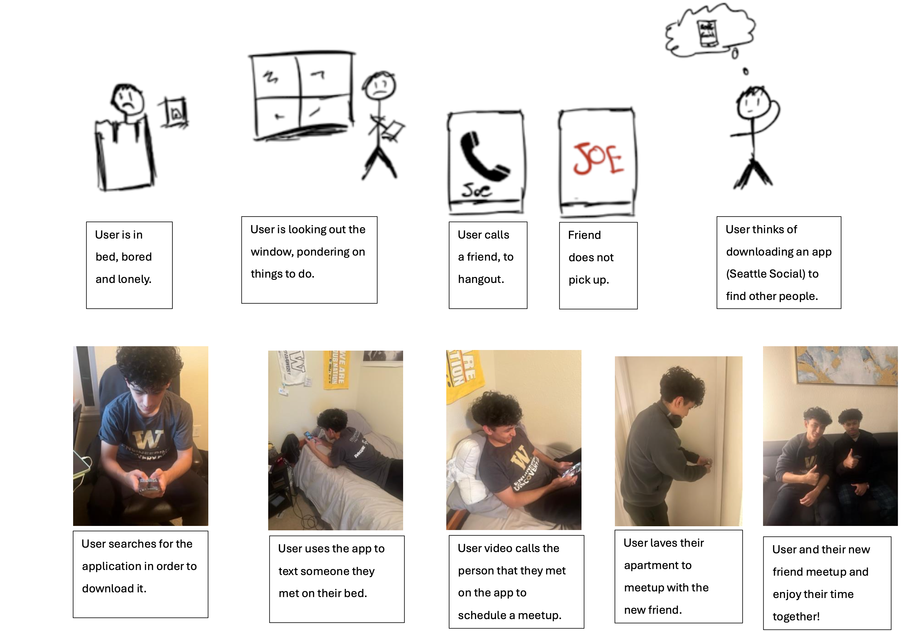

#### Why this project?
- **Purpose:** Create a meetup platform in Seattle for young adults to connect and form friendships.
- **Goal:** Enhance newcomers' social experiences and combat the [Seattle Freeze](https://en.wikipedia.org/wiki/Seattle_Freeze).

#### Research findings
- **Method:** Conducted surveys, interviews, and contextual inquiries.
- **Outcome:** Grounded project in real user needs and shaped persona development. [Research findings here.](../assets/pdf/hcde318/UserResearch.pdf)

#### Persona
- **Description:** "Jafar," a young professional new to Seattle seeking a social circle.
- **Usage:** Guided user journey mapping and kept design user-focused.

#### Journey map
- **Visualization:** Represents "Jafar's" process from app discovery to forming friendships.
- **Purpose:** Identifies design intervention opportunities and bridges persona to design requirements.

#### Design requirements
- **Features:** Easy onboarding, search filters, and social event organization tools.
- **Framework:** Ensures alignment with user needs.
- **Design Requirements**
1. Encourage users to complete their profiles with detailed interests and preferences.
2. Facilitate the creation and management of social events for users to attend.
3. Match users with potential friends based on shared interests and activities.
4. Provide notifications about upcoming events and new friend suggestions.
5. Ensure users can communicate securely and privately within the app.

#### Storyboards
- **Function:** Visualize potential user interactions with the app.
- **Role:** Facilitates brainstorming and design refinement. 

#### Lo-fi prototype
- **Composition:** Wireframes detailing app structure and functionality.
- **Process:** Allows quick iteration based on user feedback during usability testing.

#### Quick eval findings
- **Findings:** Documented key usability issues and user feedback from prototype testing.
- **Impact:** Guided refinements in design to enhance user satisfaction.

#### High-fidelity mock-up
- **Presentation:** Detailed visuals and interactivity showcasing the app's core functions.
- **Development:** Represents final product vision, incorporating feedback and previous designs. [See high-fidelity mock-up here.](https://www.figma.com/proto/MtbbnMuszjHysJohxtSqTD/Seattle-Social?page-id=1%3A2&node-id=1-4&starting-point-node-id=1%3A4&t=QXciZJfk3oyyEHCF-1)

#### Reflection
- **Lessons Learned:** Emphasized the importance of user-centered design and iterative testing.
- **Challenges:** Balancing user needs with technical constraints.
- **Surprises:** User insights can significantly alter design directions.
